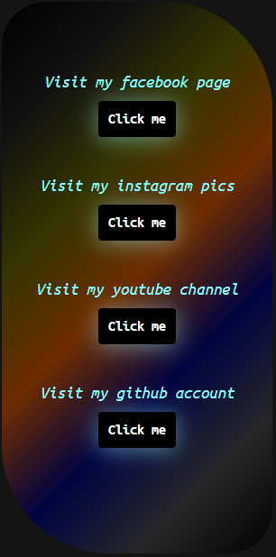

# 🔄 FlipCard Project | Akash Giri

Welcome to my **FlipCard Project**, a stylish web component that flips on hover to reveal hidden content — just like magic! ✨

## 💡 What It Does

When you **hover over the card**, it **flips** to show the back side. When you **move the cursor away**, it flips back to the front. Smooth, responsive, and visually clean.

- 🧍‍♂️ **Front Side**: Shows **Akash Giri’s image** along with his **academic information** 📚.
- 🌐 **Back Side**: Reveals **all of Akash's social media links** — one tap and you're connected!

## 🛠️ Built With

- HTML5
- CSS3 (With transitions and transforms)
- JS
- 🔄 Flip animation on hover

## 🎯 Features

- Sleek 3D **card flip animation**
- Responsive layout
- Clean design
- Easy to customize
- Hover-triggered interaction


## 📸 Screenshots

| Front View | Back View |
|------------|-----------|
|  |  |

## 🔗 Connect with Akash Giri

Feel free to connect on:

- [LinkedIn](https://www.linkedin.com/in/your-profile)
- [GitHub](https://github.com/devStormAkash)
- [Twitter](https://twitter.com/your-handle)
- [Instagram](https://instagram.com/your-handle)

---

## 🚀 Getting Started

Clone the repository:

```bash
git clone https://github.com/devStormAkash/FlipCard-Project.git
